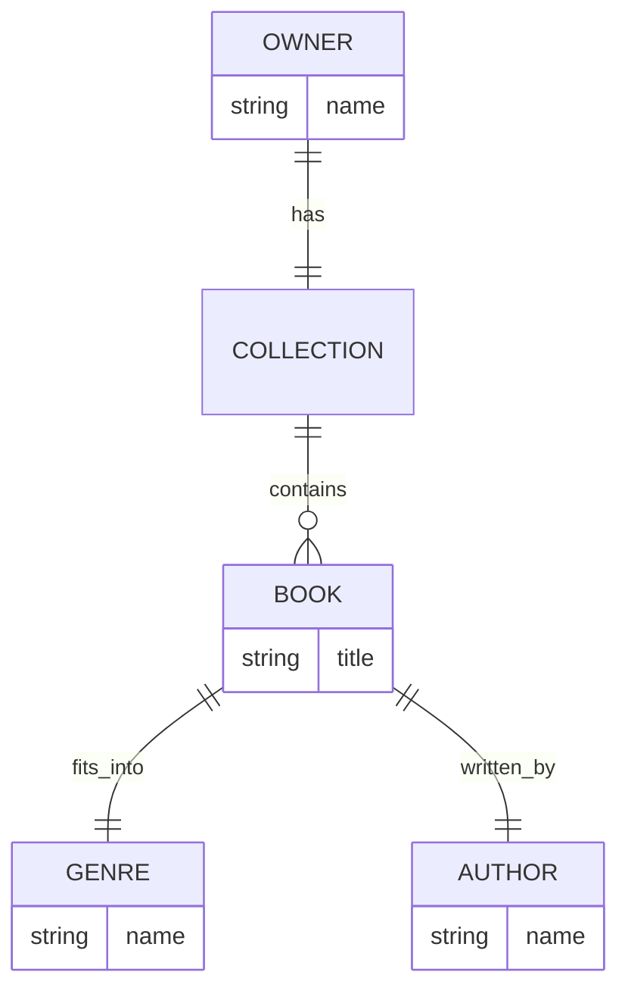

# The Churchill Library

Ruby on Rails application for the Churchill Library.

More details to come.

## Database Design

```mermaid
erDiagram
    OWNER {
        string name
    }
    COLLECTION {
    }
    BOOK {
        string title
    }
    GENRE {
        string name
    }
    AUTHOR {
        string name
    }

    OWNER ||--|| COLLECTION: has
    COLLECTION ||--o{ BOOK : contains
    BOOK ||--|| GENRE : fits_into
    BOOK ||--|| AUTHOR : written_by
```
