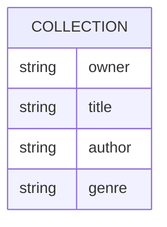

# The Churchill Library

Ruby on Rails application for the Churchill Library.

More details to come.

## Database Design

Let's keep this simple and just have a single database table.
Although this model could be broken into tables to help normalize the design,
I find this is unnecessary for this size of application where it's expected to have <1,000 books.
Furthermore, I plan on using clever methods in the controller and Hotwire features to improve the data consistency in the `owner`, `author`, and `genre` fields.

