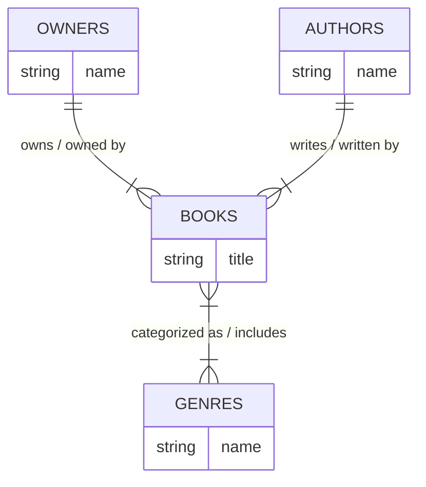

# The Churchill Library

Ruby on Rails application for the Churchill Library.

## Hosting

This application is hosted using Heroku and available at
[https://library.churchill.com](https://library.zachurchill.com/)
.

## Database Design

Postgresql is used for dev, test & production where the `compose.yml` provides the development & test databases for local development.
Use `podman-compose up -d` to get the postgres services up prior to development.

